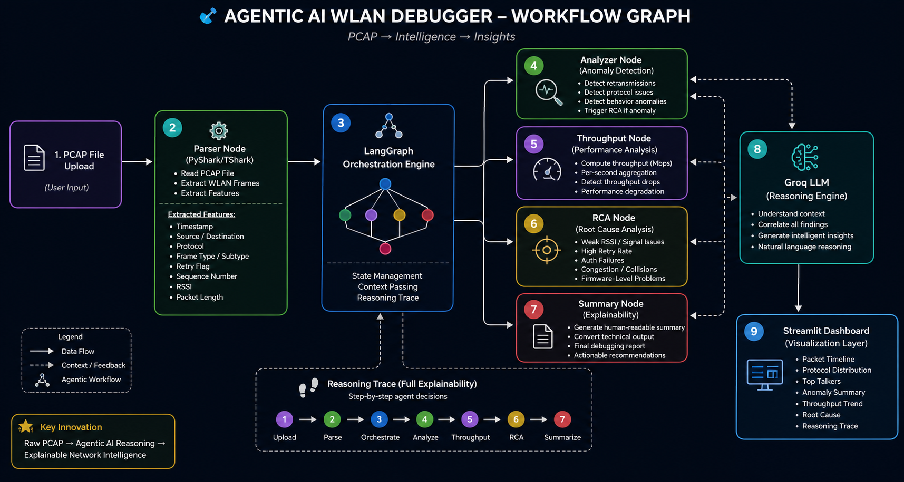
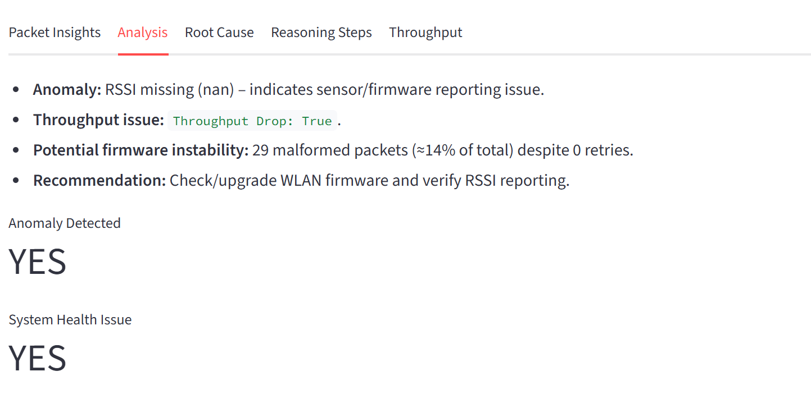
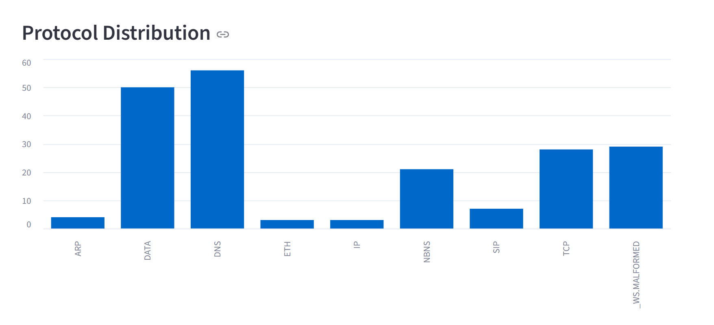
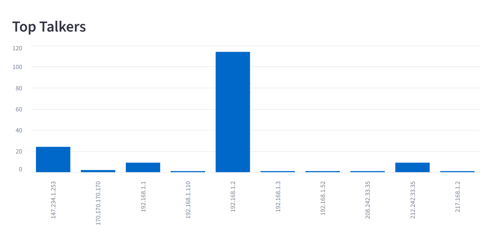
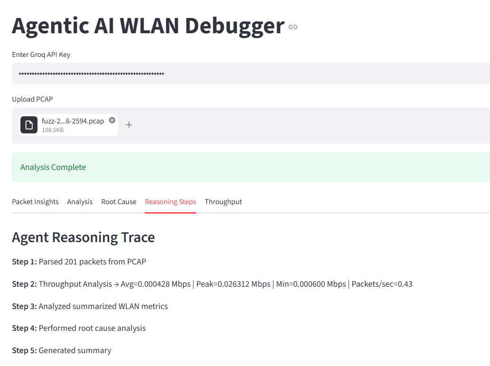
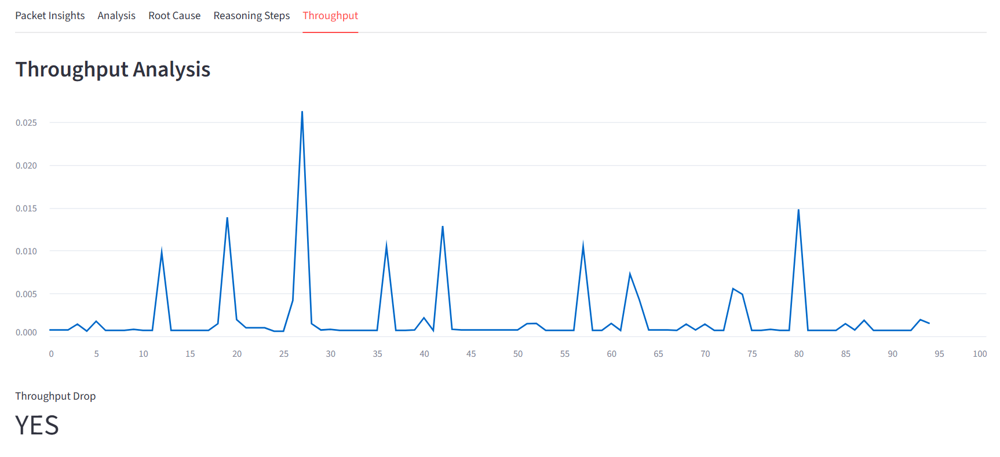
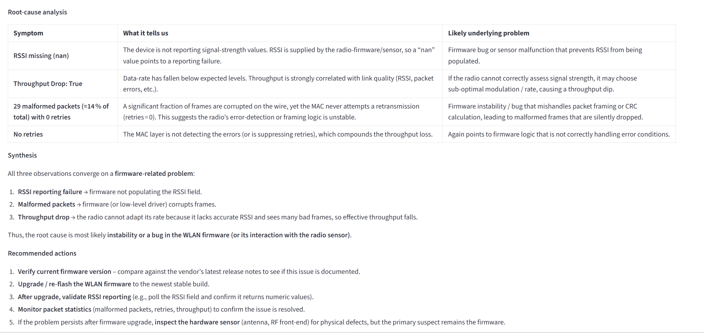
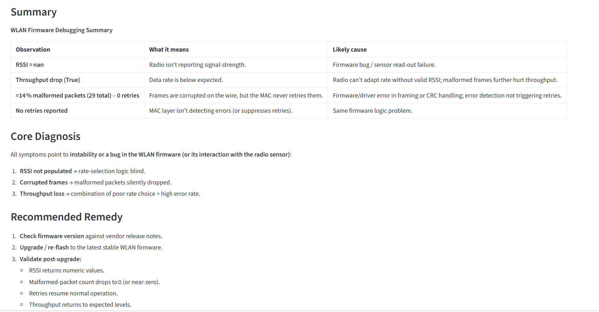

# Agentic AI WLAN Debugger (PCAP Intelligence System)

An end-to-end **Agentic AI system for WLAN firmware debugging** that converts raw Wireshark PCAP files into actionable, explainable network diagnostics using **LangGraph + LLM reasoning + packet analysis**.

This system removes the need for manual Wireshark inspection by automatically detecting:
- Network anomalies
- Throughput degradation
- Firmware-level issues
- Root causes of WLAN failures

---

## Problem Statement

WiFi/WLAN debugging is traditionally:

- Manual and time-consuming  
- Requires deep protocol expertise  
- Hard to scale for large PCAP datasets  
- Difficult to reproduce insights consistently  

---

## Solution

This system builds an **AI-powered debugging pipeline** that:

- Parses PCAP files automatically   
- Extracts WLAN features 
- Detects anomalies + throughput drops  
- Identifies root causes   
- Generates explainable insights 
- Visualizes network behavior  

---

## System Architecture

<p align="center">
  
</p>

---

## Agent Workflow

### 1. Parser Node
- Reads PCAP file using PyShark
- Extracts WLAN packet features:
  - MAC addresses
  - Frame types
  - RSSI values
  - Retry counts
  - Sequence numbers
  - Packet length
  - Timestamp

---

### 2. Analyzer Node
- Detects anomalies in WLAN traffic
- Identifies:
  - Retransmissions
  - Protocol inconsistencies
  - Packet behavior issues
- Triggers RCA if anomaly detected

---

### 3. Throughput Node
- Computes throughput (Mbps over time)
- Detects:
  - Sudden bandwidth drops
  - Performance degradation
- Aggregates per-second traffic analysis

---

### 4. RCA Node
- Identifies root cause of issues:
  - Weak signal strength (RSSI)
  - High retry rates
  - Authentication failures
  - Network congestion

---

### 5. Summary Node
- Converts technical output into human-readable insights
- Generates final debugging report

---

## Dashboard Features (Streamlit UI)

### Packet Insights
- Packet timeline visualization
- Protocol distribution
- Top talkers (source analysis)

### AI Analysis
- Anomaly detection (YES/NO)
- LLM explanation of behavior

### Throughput Analysis
- Mbps trend over time
- Drop detection visualization

### Root Cause Analysis
- Firmware/network issue explanation
- AI-generated diagnostics

### Reasoning Trace
- Step-by-step agent decisions
- Full explainability of AI pipeline

---

## Tech Stack

| Layer | Technology |
|------|------------|
| Agent Framework | LangGraph / LangChain |
| LLM | Groq API (groq/compound) |
| Packet Parsing | PyShark / TShark |
| Backend | Python |
| UI | Streamlit |
| Data Processing | Pandas |

---

## Installation

### 1. Clone Repository
```bash
git clone https://github.com/haseebkhan02/Agentic WLAN Debugger.git
cd Agentic WLAN Debugger.
````

---

### 2. Create Virtual Environment

```bash
python -m venv venv
venv\Scripts\activate   # Windows
```

---

### 3. Install Dependencies

```bash
pip install -r requirements.txt
```

---

## Environment Setup

Create a `.env` file:

```env
GROQ_API_KEY=your_api_key_here
```

---

## Run Application

```bash
streamlit run app.py
```

---

## Project Structure

```
wlan-agentic-ai/
│
├── app.py
│
├── graph/
│   ├── workflow.py
│   ├── state.py
│   ├── conditions.py
│
├── nodes/
│   ├── parser_node.py
│   ├── analyzer_node.py
│   ├── throughput_node.py
│   ├── rca_node.py
│   ├── summary_node.py
│
├── tools/
│   ├── pcap_tool.py
│
├── llm/
│   ├── groq_client.py
│
├── utils/
│   ├── visualization.py
│
├── requirements.txt
└── README.md
```

---

## Output Insights

### Example Results

* **Anomaly Detected:** YES
* **Throughput Drop:** YES (45% drop)
* **Root Cause:** High retransmissions due to weak RSSI
* **Insight:** Possible RF interference or firmware ACK delay


## Dashboard Output
### Packet Analysis Dashboard



### Protocol Distribution


### Top Talkers


### Reasoning Steps


### Throughput Analysis


### Root Cause Analysis


### Summary



---

## Limitations

* Depends on PyShark / TShark stability
* Large PCAP files may slow processing
* Requires Wireshark installed locally
* Not yet real-time streaming

---

## Future Improvements

* Real-time packet streaming (Kafka / sockets)
* Scapy-based crash-free parser
* Cloud deployment (AWS / Kubernetes)
* Live WiFi monitoring dashboard
* ML-based anomaly detection models
* Multi-protocol support beyond WLAN

---

## Key Innovation

This system transforms:

> Raw PCAP → Agentic AI reasoning → Explainable network intelligence

By combining:

* Network engineering
* Agentic AI systems
* LLM reasoning pipelines
* Observability dashboards

---

## Author

**Haseeb Khan**
AI/ML Engineer | Generative AI | Network Intelligence Systems

---

## Support

If you like this project:

*  Star the repository
*  Share with engineers
*  Suggest improvements

```

